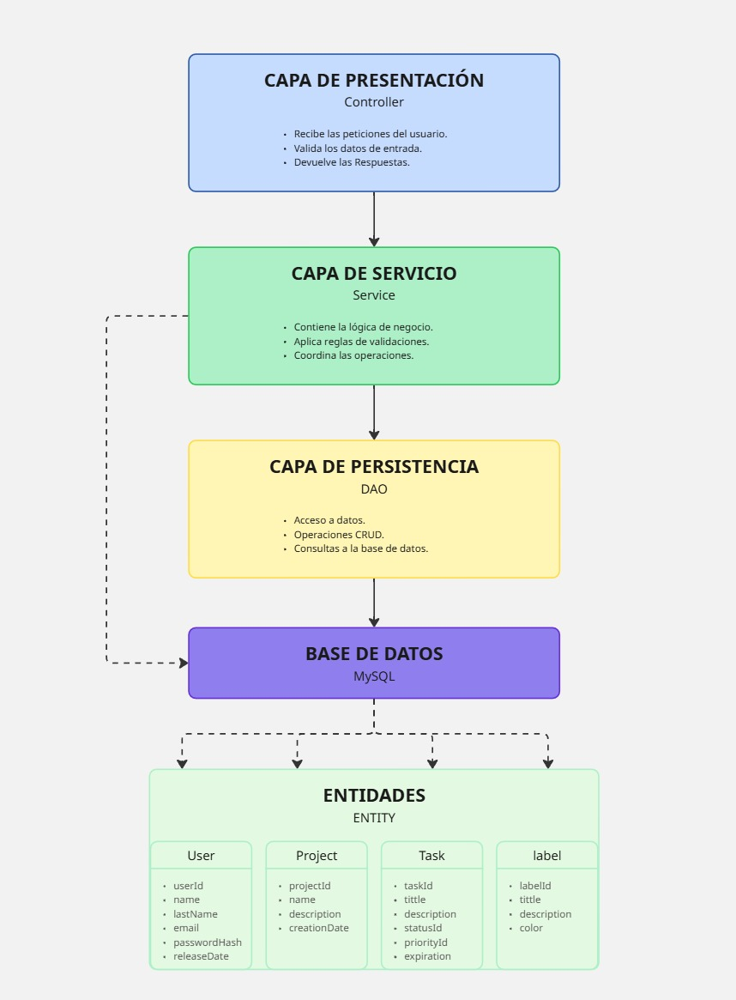

# 📝 TaskManager CLI - Java

Es una aplicación desarrollada en Java para la gestión de tareas. 
Permite administrar usuarios, proyectos, tareas y etiquetas.
Así como comprobar las fechas de cada tarea y proyecto.

#  Características
* Gestión de proyectos.
* Gestión de Tareas.
* Gestión de usuarios.
* Eliminación de usuarios.
* Comprobación de usuarios.
* Validación de fechas.
* Búsqueda por etiquetas.

# Tecnologías

#  Arquitectura
El proyecto utiliza una arquitectura por capas para separar las responsabilidades de la aplicación.
El controller Gestiona las acciones recibidas, el Service contiene la lógica de negocio 
y el DAO/Repository se encarga del acceso a los datos mediante JPA.

#  Modelo de datos
La base de datos está formada principalmente por las entidades Usuarios, Proyectos y Tareas.
Cada Usuario tiene un proyecto asignado y en estos proyectos se encuentran las tareas a realizar por dicho usuario con una fecha limite.

# Capturas de la CLI | In progress
* Auntetificación.
* Gestión de Usuario.
* Main Menu.
* Gestión de Proyectos.
* Gestión de Tareas.
* Gestión de Etiquetas.
* Crear Proyecto / Tarea / Etiqueta.

#  Documentación
📁 [Requisitos](docs/requisitos.md)
📁 [Diseño](docs/diseno/Design.md)
📁 [Base de datos](docs/base-datos/data-model.md)
📁 [Instalación](docs/Instalación.md)
📁 [Manual de usuario](docs/Manual-de-usuario.md)
