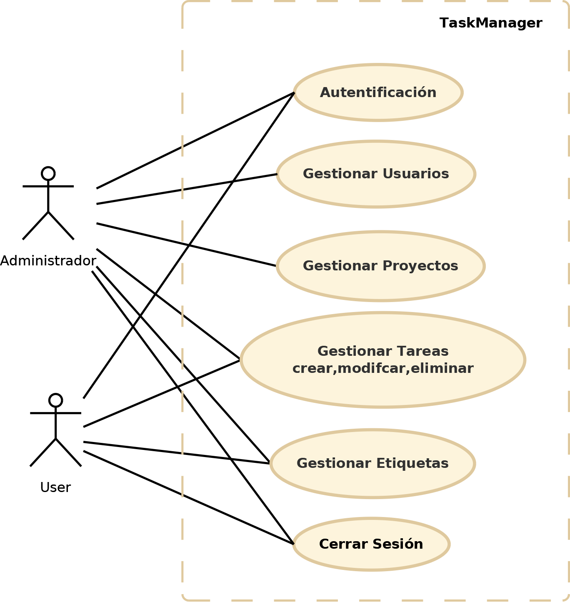
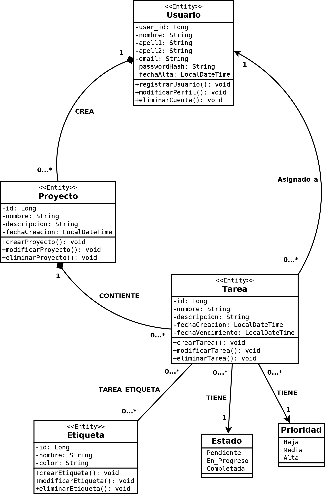
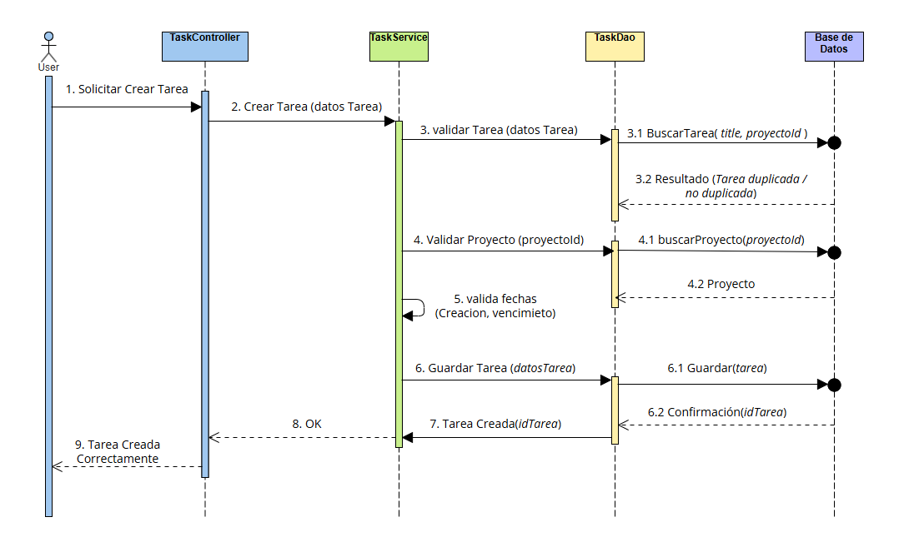
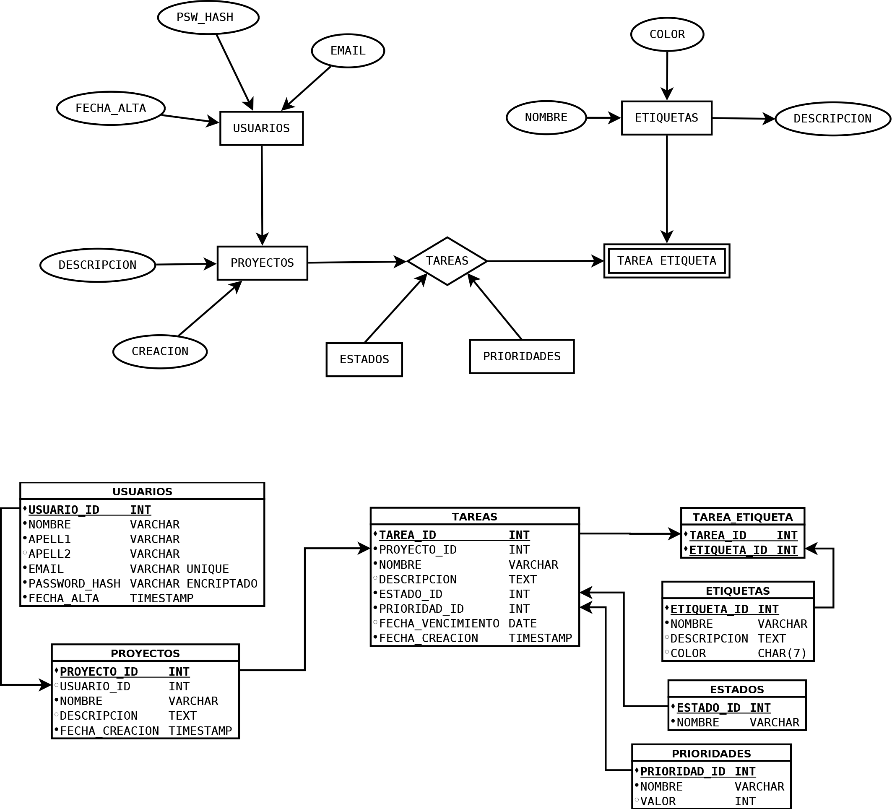

# 📚 Documentación — TaskManager
Sección de documentación técnica y funcional del proyecto TaskManager.

#  Índice
1. [Requisitos.](#Requisitos)
2. [Análisis.](#Análisis)
3. Diseño.
4. Base de Datos.
5. Instalación.
6. Manual de usuario.

# Requisitos
  ### 01.- Requisitos Funcionales:
  
  * #### RF-01  Gestión de usuarios:   
  >El sistema debe permitir registrar, modificar y eliminar usuarios nuevos.
  * #### RF-02 - Gestión de Proyectos: 
  >El sistema debe detectar los proyectos del usuario y Permitirle crear nuevos proyectos, modificar los existentes o eliminarlos. El owner añade usuarios a su proyecto.
  * #### RF-03 - Gestión de Tareas:
  >Dentro de cada proyecto, el sistema debe permitir crear, modificar y eliminar las tareas propias si es usuarios y globales si es owner de proyecto.
  * #### RF-04 - Gestión de Etiquetas:
  >Permite crear etiquetas para asignarlas a las diferentes tareas.
  * #### RF-05 - Busqueda de Tareas: 
  >Permite filtrar las tareas por ID, TITTLE o ETIQUETA.
  * #### RF-06 - Comprobar Eliminación: 
  >Cuando un usuario es eliminado todos sus proyectos, tareas, etiquetas, etc. Se eliminan con el.
  * #### RF-07 - Listar Usuarios:
  >El sistema debe permitir listar todos los usuarios de un proyecto y solo del proyecto.
  * #### RF-08 - Listar Proyectos:
  >Listará los proyectos a los que esté asociado un usuario para elegir en cual trabaja.
  * #### RF-09 - Listar Tareas:
  >Lista todas las tareas a la que está asociado el usuario en el proyecto actual.
  * #### RF-10 - Listar por etiqueta: 
  >Permite listar tareas con una etiqueta determinada en el proyecto actual.

### 02.- Requisitos No Funcionales:

  * #### RNF-01  Persistencia:   
  >La información debe almacenarse de forma persistente en una base de datos de MySQL.
  * #### RNF-02  Arquitectura: 
  >La app debe usar arquitectura por capas.
  * #### RNF-03  Integridad: 
  >El sistema debe evitar crear tareas con fechas no válidas. También debe mantener la integridad de las contraseñas de los usuarios y sus datos anónimos.
  * #### RNF-04  Mantenibilidad:
  >El código debe estar organizado separando responsabilidades entre capas.

# Análisis
  
  ### Administrador del proyecto
  >Es el encargado de administrar el proyecto, titulo, tareas, fechas de entrega y sobre todo usuarios.
  Puede:
  * Gestionar Usuarios.
  * Gestionar Proyectos.
  * Gestionar Tareas.
  * Cancelar / Eliminar el proyecto.
  * Consultar estado de progreso del proyecto.
  * Eliminar Usuarios.

  

# Diseño
  ### Diagrama de Clases
  >El siguiente diagrama representa las principales entidades del dominio y las relaciones existentes entre ellas.

  

  ### Diagrama de Secuencia: Crear Tarea
  1. El usuario Solicita crear una  tarea.
  2. El controller recibe la solicitud.
  3. El Service valida los datos.
  4. Se comprueba que la tarea no exista de antes.
  5. El Dao/Repository persiste la reserva.
  6. El sistema devuelve el resultado.
> 

  ### Arquitectura por capas
  * #### Controller
  > Gestiona las solicitudes recibidas y delega las operaciones necesarias en la capa de servicios. También recibe el resultado final.
  * #### Service
  > Contiene la lógica de negocio y las validaciones del sistema.
  * #### DAO / Repository
  > Gestiona el acceso a los datos utilizando JPA.
  * #### Entity
  > Representa las entidades del dominio y su relación con la base de datos.

  

# Base de Datos
  ### Entidades Principales
  * #### Usuario
  > Representa a las personas que emplean la aplicacón.
  * #### Proyectos
  >Representa los proyectos existentes para cada usuario.
  * #### Tareas
  >Representa las tareas asignadas a un proyecto.
  * #### Etiquetas
  > Representa las etiquetas asignadas a diferentes tateas.
  * #### Tarea Etiqueta
  > Representa la relación entre una tarea y una etiqueta.

  

  ### Relaciones
  >1. Un Usuario puede tener varios proyectos.
  >2. Un proyecto puede tener varios usuarios.
  >3. Un Proyecto solo tiene un owner.
  >4. Una tarea puede tener muchos usuarios.
  >5. Una tarea solo pertenece a un proyecto.
  >6. Un proyecto puede tener múltiples tareas.
  >7. Una tarea puede tener varias etiquetas.
  >8. Una etiqueta puede tener muchas tareas.
  >9. Una tarea tiene un estado.
  >10. Un estado puede estar en muchas tareas.
  >11. Una tarea tiene una prioridad.
  >12. Una prioridad puede estar en muchas tareas.<
      

# Instalación
# Manual de usuario.
